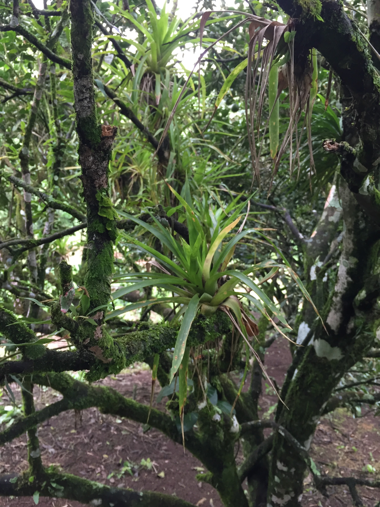
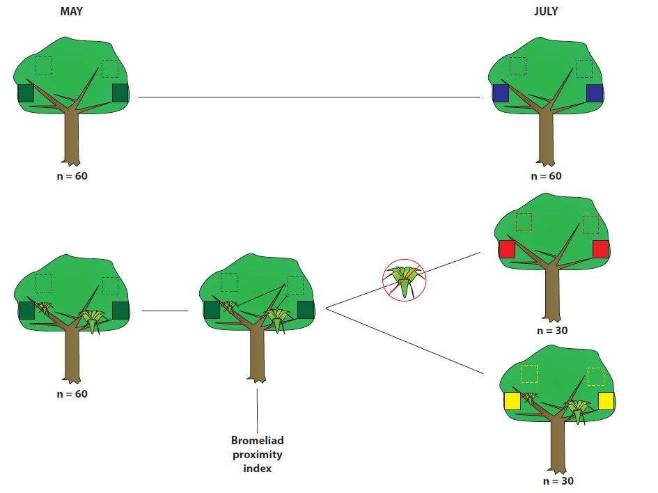

*work in progress..*

# Epiphytic tank bromeliads and habitat complexity: what are the consequences of higher predator habitat for arthropod communities?

## About
Bromeliads (family Bromeliaceae) are common plants that can be found from Chile to the Southern United States, with some species present 
in Western Africa. Species of this diverse family display a variety of life strategies, some, like the famous pineapple, are typical terrestrial plants. Other bromeliads have an epiphytic lifestyle, meaning that they do have their roots extracting nutrients from the soil to grow. Instead, epiphytic bromeliads use their roots as anchoring points on a variety of surfaces, for examples trees or electric poles. These plants also show many different life strategies, with some having mutalistic relationships with ants, also called [ant gardens](http://www.antwiki.org/wiki/Ant_gardens), while others, called tank bromeliads, obtain food from debris and water accumulating in their leaf rosette, where specialised hairs extract nutrients. 

  
The presence of bodies of water in epiphytic tank bromeliads make their study very interesting. Indeed, with each bromeliad comes an independent, replicated  aquatic ecosystem, with a relatively simple food web. The commonness of bromeliads, coupled with their simple aquatic food web, makes manipulation of ecosystem density and conditions relatively easy, making epiphytic tank bromeliads a fruitful area of ecological research, e.g. with the [Bromeliad Working Group](http://www.zoology.ubc.ca/~srivast/bwg/). Although most research on bromeliads has focused on their aquatic ecosystems, their terrestrial ecosystems show promising applicatons for theoretical and applied ecological research. In fact, as water does not accumulate in all leaf wells, a part of the bromeliad rosette remains dry or moist, and is occupied by a variety of arthropods seeking nesting grounds and protection from larger predators. What makes terrestrial bromeliad eosystems particularly interesting is that most of their terrestrial inhabitants, for instance ants, spiders and predatory beetles, are predatory.

So, if bromeliads attract predators, what are the consequences for other arthropods dwelling around the bromeliads? What are the ecological consequences of increased predator habitat and abundance in an arthropod community?  
If the bromeliad grows on a tree, will the tree arthropod community be impacted in some form of spill-over effect? Is it possible to harness this natural artifact to develop sustainable agriculture techniques?  

These are some of the questions that Pierre Rogy's Master's thesis, under the supervision of [Dr. Diane Srivastava](http://www.zoology.ubc.ca/~srivast/) and [Dr. Edd Hammill](https://www.eddhammill.com/), seeks to answer. The present data was collected between April and July 2017, in orange orchards in and around, Santa Cecilia, Guanacaste, Costa Rica (11°03′51″N 85°25′06″W) in three different orchards called CP, ER, DO (CP = Calixto Moraga and Petrona Ríos, ER = Ernesto Rodriguez, DO = Del Oro S.A.).

## Aim
The objective of this repository is to offer open access to code and data for all research items stemming from this project, under Apache 2.0 license. The final, published version of items can be found below (*work in progress*). 

## Methods
Methods are thoroughly explained in papers but, in essence, they can be divided in two parts.

### 1. The core project
For the core project, we wanted to analyze the effect of bromeliads their support tree arthropod communities (in its entirety or on subsets only) and leaf damage (a proxy for extent of herbivory). We folled a [Before-After-Control-Impact (BACI)](http://people.stat.sfu.ca/~cschwarz/Stat-650/Notes/Handouts.readings/smith-2002-EES-baci.pdf) design, a simple method  particularly effective at separating natural variation from experimental effects.  
First, we selected 20 trees with bromeliads and 20 trees without bromeliads in 3 different orchards (n=120). We set selected four 50x50x100cm quadrats (coloured squares in the figure below) in each tree; randomly in trees without bromeliads, and with the first quadrat near the largest bromeliad in trees with bromeliads (we hypothesized that the effect of bromeliads will depend on the distance from the bromeliad).  
Second, we left tuna (protein) and honey (sugar) baits for 15-20 minutes the base of the crown of each tree, in order to assess the ant composition. Ants tend to be one of the main tropical predators, and nest in bromeliads, hence we can see if our experiment modifies ant dynamics.  
Third, in each quadrat, we vacuumed the arthropod community with cordless electric leaf blower, and randomly collected five leaves (to measure leaf damage).  
Fourth, we measured bromeliad size and all bromeliad-quadrat distances in each tree, in order to compute a proximity index. This index is the sum of bromeliad sizes weighted by their distance to the quadrat (the larger the index, the larger and closer the bromeliads).  
Finally, we removed bromeliads from a random half of trees that intially bore them. We repeated this design on the same trees and quadrats two months later.

There are thus three distinct treatments in this experiment:  
-trees that never had bromeliads (**Without**, blue)  
-trees that had bromeliads removed after the first sampling period (**Removal**, red)  
-trees that always had bromeliads (**With**, yellow) 

So, if bromeliads actually have an effect, we expect the **With** and **Removal** treatments to be similar in the first sampling period (in May), but the **Removal** and **Without** treatments to be similar in the second sampling period (in July).

### 2. The observation experiment
The aim of the observation experiment is simply to assess if bromeliads modify arthropod behaviour. In fact, if predators can consume their preys, they also can induce behavioural effects, which may offset 'fear' effects.  
The experimental design was also much simpler, and did not involve direct manipulation. Instead, each tree was observed four times for five minutes in a randomly selected 50x50x50cm quadrat. At CP, we selected three blocks of 12 trees and repeated observations twice at a 7-week interval, with diurnal and two nocturnal observations. At DO, we observed once 84 trees.

## Metadata
### Bromzy
### Distance
### La Mona
### Leaf Damage
### Observation

## Link to thesis/papers

## Acknowledgements
