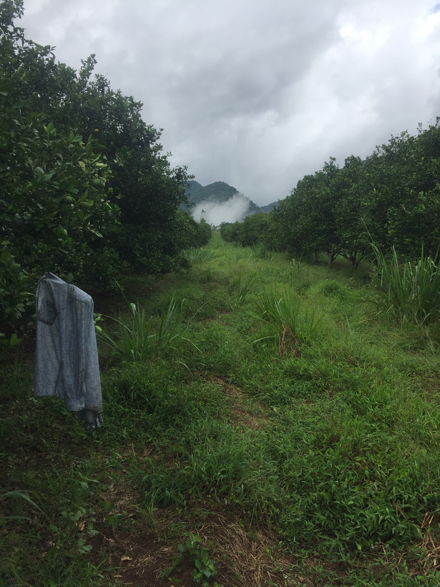
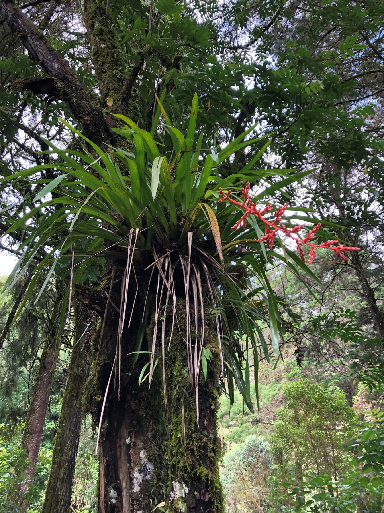
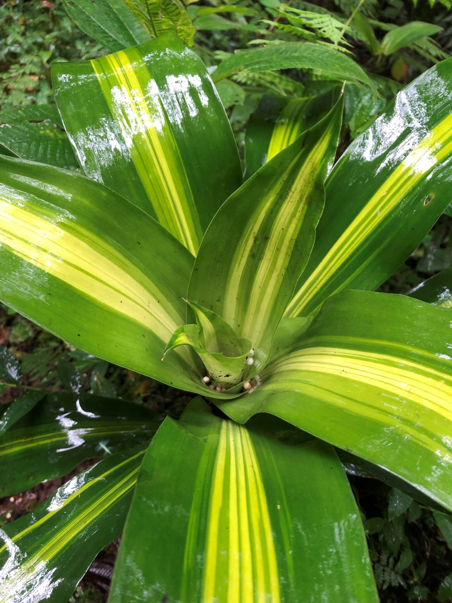
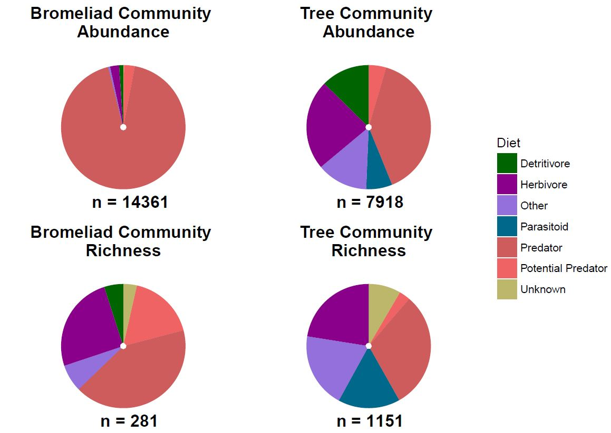
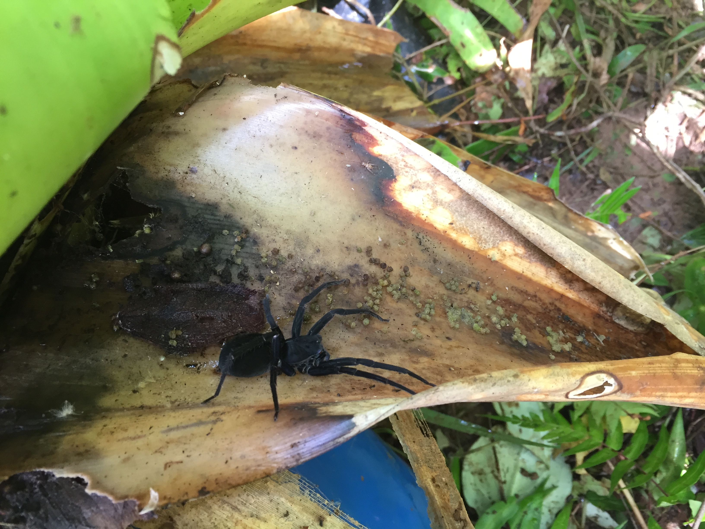

# Epiphytic tank bromeliads and ecosystem engineering: what consequences for surrounding arthropod communities?

## About
How the diversity of habitats of an ecosystem, or habitat heterogeneity, may affect ecological communities is the main question I tried to answer in my Master's thesis, under the supervision of [Dr. Diane S. Srivastava](https://www.zoology.ubc.ca/~srivast/index.html). Although higher habitat heterogeneity is generally linked to higher species richness, more complex effects are still poorly understood. One of these is the impact linked to the combined increase in abundance of a particular kind of habitat and its associated species, on other species in surrounding habitats.

Epiphytic tank bromeliads of tropical Central America offer a great system to study these questions. As epiphytes, they grow on a variety of substrates, including trees, and collect debris in wells formed by their leaf rosette. Bromeliads thus create a particular kind of terrestrial habitat, one that is mainly occupied by arthropod predators, such as ants or spiders. Because predators inhabiting bromeliads also forage around the bromeliad, it is hypothesized that greater bromeliads abundance on a tree would increase the density of predators foraging on that tree, thereby reducing herbivores feeding off the tree. 

I examined two different ways in which bromeliads may impact herbivores on their support tree:
- in a manipulative experiment, where I assessed the invertebrate composition of bromeliads, and whether increased bromeliad density (i.e. habitat for predators), resulted in reduced herbivore densities and leaf damage in their support tree;
- in an observational survey, where I examined if the presence of bromeliads on a tree indirectly modified the composition and behaviour of arboreal invertebrates. 

In the manipulative experiment, I found complex effects of bromeliads on the invertebrate communities of their support tree. On their support tree, bromeliads increased the density of their associated predators. However, despite this increase in predators, there was no effect of bromeliads on herbivores and amount of damage on leaves. Moreover, the effect of bromeliads on predators were also dependent on the season of sampling, being stronger in the dry season than in the wet season.

In the observational survey, I found that bromeliads had subtle effects on the taxonomic composition in their support tree and that they did not impact the behaviour of arboreal invertebrates. Nonetheless, bromeliads altered how arboreal invertebrates interact, in that their presence was linked to an increase in positive interactions. We also found a contingent effect of time of day (day vs. night), in which ants associated with bromeliads and ants not associated with bromeliads farm honeydew at different times.

These studies are interesting because they seem to contradict a [study](https://onlinelibrary.wiley.com/doi/full/10.1111/btp.12073) led by my co-supervisor [Dr. Edd Hammill](https://www.eddhammill.com/), in which the presence of bromeliads in a tree effectively reduced leaf damage when compared to trees without bromeliads. Here, the main difference lied in the identity of the most common ant species, which tend to be the most common predators in tropical systems. This therefore implies that the same ecological system can behave differently depending on the identity of common species. Such results are relevant in sustainable agricultural practices that aim at establishing natural enemies populations to control pest species.

## Project outputs
### Metadata
[Data](https://doi.org/10.5061/dryad.b4c364r) and [metadata](https://github.com/pierrerogy/bromagro/tree/master/Metadata_manipulative_experiment) are presently available for the manipulative experiment.

### Thesis
To have a look at the thesis, please follow [this link](https://open.library.ubc.ca/cIRcle/collections/ubctheses/24/items/1.0371615).

### Papers
Rogy, P., Hammill, E., & Srivastava, D. S. (2019). Complex indirect effects of epiphytic bromeliads on the invertebrate food webs of their support tree. Biotropica, 51(4), 549–561. 
Links to: [paper](https://doi.org/10.1111/btp.12672), [data](https://doi.org/10.5061/dryad.b4c364r), [code](https://github.com/pierrerogy/bromagro/tree/master/Rogy_et_al_2019)

### If you're interested in learning more about bromeliad research, have a look at the [Bromeliad Working Group](http://www.zoology.ubc.ca/~srivast/bwg/)!
  

