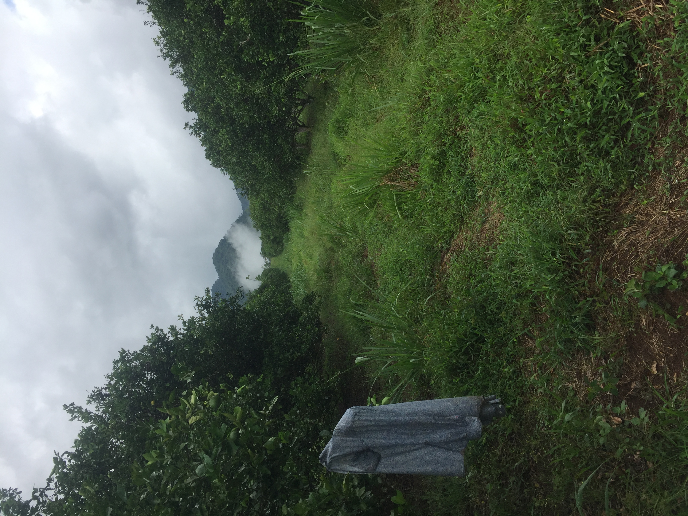
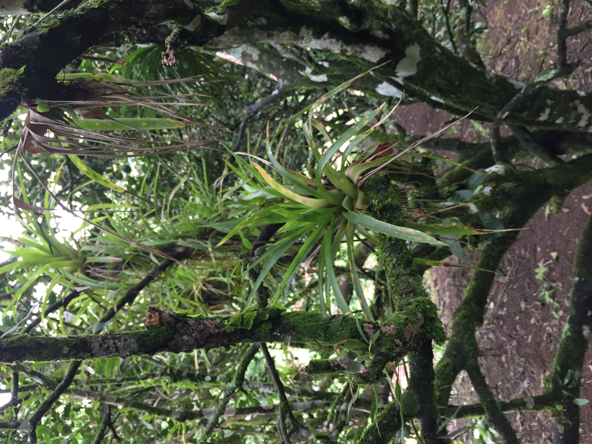
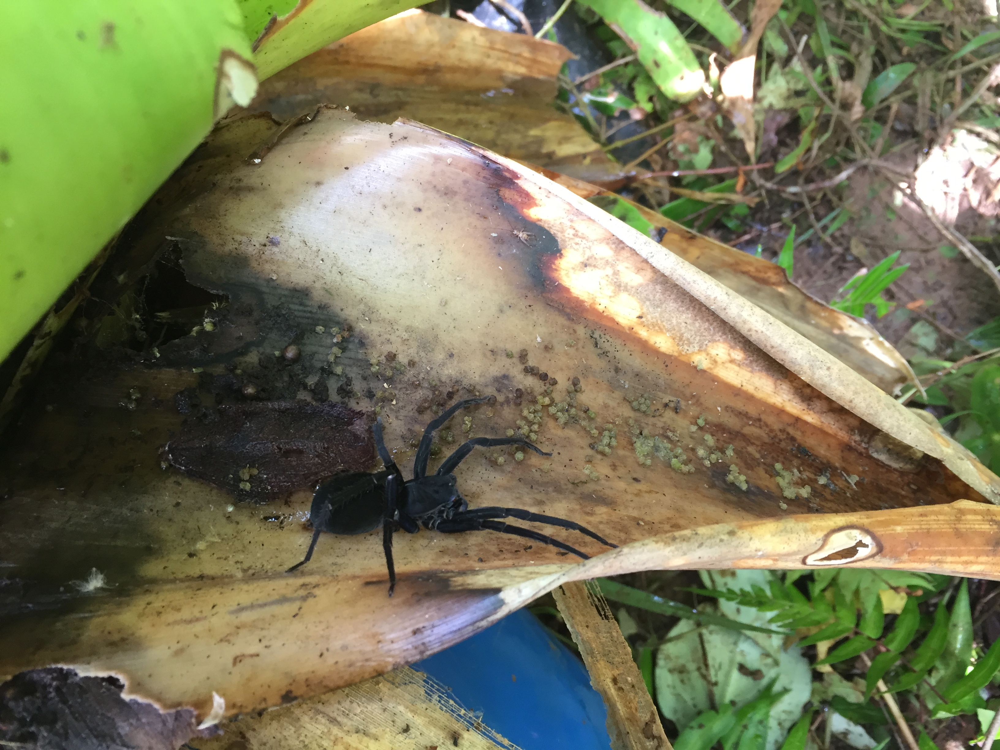
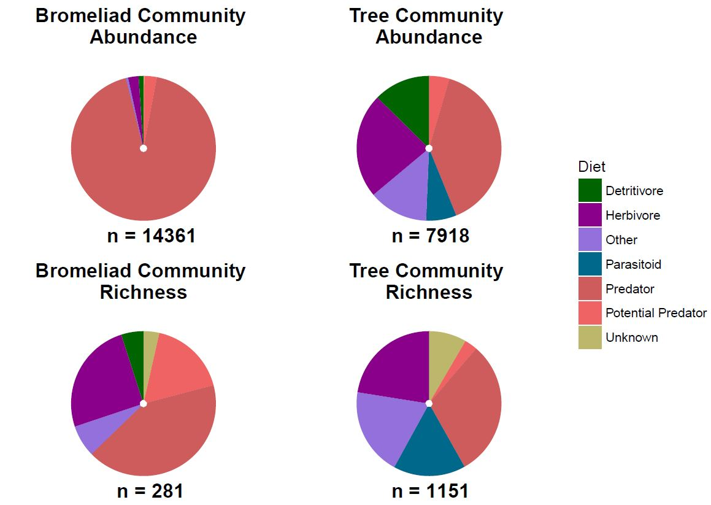

# Epiphytic tank bromeliads and habitat complexity: what are the consequences of higher predator habitat for arthropod communities?

## About
Bromeliads (family Bromeliaceae) are common plants that can be found from Chile to the Southern United States, with some species present 
in Western Africa. Species of this diverse family display a variety of life strategies, some, like the famous pineapple, are typical terrestrial plants. Other bromeliads have an epiphytic lifestyle, meaning that they do have their roots extracting nutrients from the soil to grow. Instead, epiphytic bromeliads use their roots as anchoring points on a variety of surfaces, for examples trees or electric poles. These plants also show many different life strategies, with some having mutalistic relationships with ants, also called [ant gardens](http://www.antwiki.org/wiki/Ant_gardens), while others, called tank bromeliads, obtain food from debris and water accumulating in their leaf rosette, where specialised hairs extract nutrients. 

The presence of bodies of water in epiphytic tank bromeliads make their study very interesting. Indeed, with each bromeliad comes an independent, replicated  aquatic ecosystem, with a relatively simple food web. The commonness of bromeliads, coupled with their simple aquatic food web, makes manipulation of ecosystem density and conditions relatively easy, making epiphytic tank bromeliads a fruitful area of ecological research, e.g. with the [Bromeliad Working Group](http://www.zoology.ubc.ca/~srivast/bwg/). Although most research on bromeliads has focused on their aquatic ecosystems, their terrestrial ecosystems show promising applicatons for theoretical and applied ecological research. In fact, as water does not accumulate in all leaf wells, a part of the bromeliad rosette remains dry or moist, and is occupied by a variety of arthropods seeking nesting grounds and protection from larger predators. What makes terrestrial bromeliad eosystems particularly interesting is that most of their terrestrial inhabitants, for instance ants, spiders and predatory beetles, are predatory.

So, if bromeliads attract predators, what are the consequences for other arthropods dwelling around the bromeliads? What are the ecological consequences of increased predator habitat and abundance in an arthropod community?
If the bromeliad grows on a tree, will the tree arthropod community be impacted in some form of spill-over effect? Is it possible to harness this natural artifact to develop sustainable agriculture techniques?

These are some of the questions that Pierre Rogy's Master's thesis, under the supervision of [Dr. Diane Srivastava](http://www.zoology.ubc.ca/~srivast/) and [Dr. Edd Hamill](https://www.eddhammill.com/), seeks to answer. The present data was collected between April and July 2017, in orange orchards in and around, Santa Cecilia, Guanacaste, Costa Rica (11°03′51″N 85°25′06″W).

## Aim
The objective of this repository is to offer open access to code and data for all research items stemming from this project, under Apache 2.0 license. The final, published version of items can be found below. 

*work in progress..*

## Acknowledgements

## Link to thesis/papers

## Notes on R code
